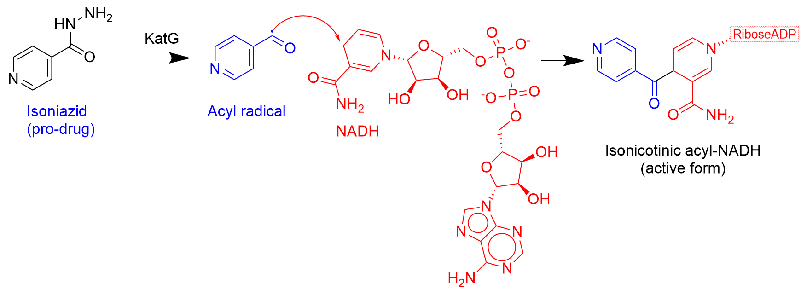

InhA is a NADH dependent enzyme found in the FAS-II (fatty acid synthesis II) pathway unique to bacteria, mycobacteria, and parasitic protozoans. InhA catalyzes one of the final steps in the fatty acid elongation pathway and is the target of one of the primary first line tuberculosis antibiotics, Isoniazid. The drugs ethionamide and prothionamide also target InhA.  It is one of the best validated targets for treating tuberculosis and the object of intense research effort.  In other bacteria, the homologous enzyme is called FabI.

## Protein and natural substrate

InhA catalyzes the hydrogenation of an unsaturated enoyl-ACP to a saturated acyl-ACP.  It is one of the final steps in the elongation pathway and the likely rate limiting.  NADH is the required co-factor and provides a source of binding interactions with the substrate and contributes to the reduction by donating a hydrogen upon tranformation to NAD^+^.  H~2~O

<!-- Sub and superscripts examples - x^2 = x^2^,  H2O = H~2~O -->
<!-- Image notes - include image in same directory as the markdown file -->
<!-- Include image of chemical transformation of enoyl-ACP to acyl-ACP -->

Isoniazid acts as a pro-drug, getting activated by enzyme KatG to an acyl radical before it irreversibly reacts with NADH.  The adduct is then a tight binding reversible inhibitor of InhA.

<figure markdown="span">
  { width="600" }
  <figcaption>Isoniazid activation</figcaption>
</figure>

## Available crystal structures

There are many crystal structures of InhA in the pdb database.  A brief selection is summarized below.

*Table 1 -* InhA apo structures

| pdb | year | resolution | notes |
| --- | --- | --- | --- |
| PH | PH | PH | PH |  

*Table 2 -* co-crystal structures

| pdb | year | resolution | ligand1 | ligand2 | notes |
| --- | --- | --- | --- | --- | --- |
| PH | PH | PH | PH | PH | PH |  

## Inhibitors

*Table 3 -* approved drugs with InhA activity

| drug | year approved | clinical use | notes |
| --- | --- | --- | --- |
| PH | PH | PH | PH |  

*Table 4 -* known inhibitor classes

| scaffold/type | trial phase | notes |
| --- | --- | --- |
| PH | PH | PH |  

## Equilibrated Computational Structures 

## Additional features test

<!--
Testing inline equations:  $P = \frac {nRT}{V}$

And single line equations:

$$ \Delta G = -RT ln(K) $$
--->
