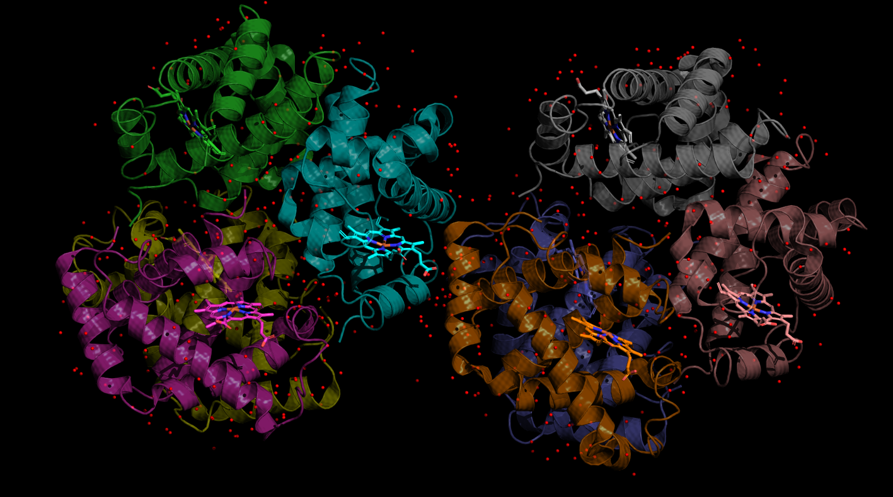
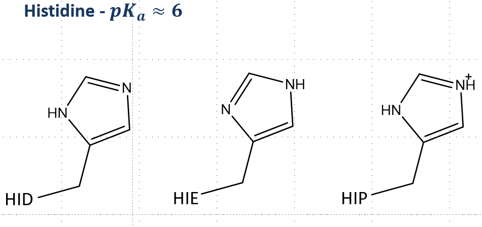
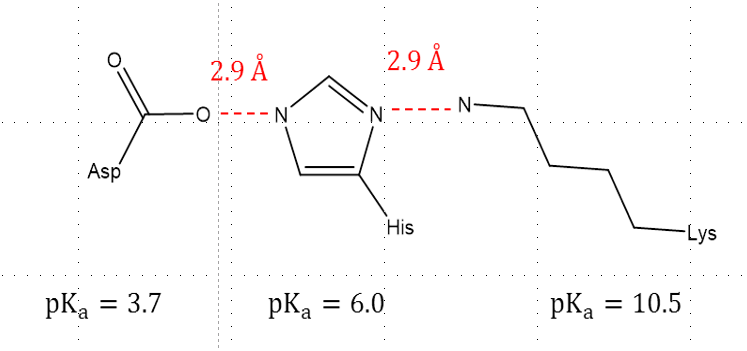

## The Protein Databank ( https://www.rcsb.org/ )

The protein databank (pdb) is a repository for published structural data on proteins, DNA, and other biomacromolecules.  Though the primary source of structures is from X-ray crystallography, there are also structures from NMR, Cryo EM, and even neutron diffraction experiments. 

Structures are designated by a 4 character code, which can consist of letters and numbers.  For example, 2HBS is the code for a hemoglobin protein, the oxygen carrier protein found in our blood. In addition to typical sequence of amino acids, this protein has a heme group, a complex that binds an iron ion, and is the binding site for oxygen molecules. 

## Initial evaluation

Start by inspecting the entry page on the pdb website for your structure of interest.  Using 2HBS as our example, you can see a visual of the structure, the DOI linking to the paper with the details of this struture determination, the resolution, and many other technical details.  

Scrolling down to the Macromolecules section, you find the protein details, how many chains or subunits in this protein, and how many amino acids make up a chain.  In this structure, they have a dimer of alpha and beta hemoglobin, the alpha hemoglobin has 4 identical chains of 141 amino acids each, and the beta hemoglobin has 4 identical chains of 146 amino acids each.  

Scrolling to the small molecules section, you find the heme group, there are 8 hemes total, one per protein chain.

Most structures will also include waters (sometimes called crystal waters), and will show up as individual oxygen atoms (hydrogens not resolved).

Often there are also crystallization compounds, buffers, detergents, other small molecules that were used in the crystallization process, but have no biological role.

## Visual evaluation

Visually inspecting a structure is vital to getting to know a protein system.  Pymol excels in protein visualization and has a fetch tool to download structures directly from the pdb website.  See [here](Setting_up_your_environment.md) for setting up a python miniconda environment and installing pymol.

Inside pymol, you'll see a place to enter commands labeled "PyMOL>".  To download the protein, try:

```
fetch 2HBS, type=pdb
```
A struture should appear and an object is created called 2hbs on the rightside pane.  Next to the object name are some menus, labeled "A|S|H|L|C", which stands for "ACTION | SHOW | HIDE | LABEL | COLOR".  Try coloring it by chain to see the 8 subunits.  The protein chains default view is cartoon, which mostly tracks the protein backbone and shows secondary structures (alpha helices, beta sheets, and disordered loops), and does not show the amino acid side chain.

Under the Display menu, select sequence to bring up the list of Amino acids and small molecules in the structure.  The protein is listed first, followed by small molecules, followed by waters.  Let's select the HEME groups so we can change their view individually. Type:
```
select resname HEM
```
A new object called (sele) appears on the right hand pane, and the 8 heme groups are now colored pink.  Select HIDE -> everything, then SHOW -> sticks, then COLOR -> chain -> by chain element.  You should now be able to clearly distinguish the heme groups from the rest of the protein.  To really make them pop out, let's also make the protein cartoon view semi-transparent.  Go to the menu: Setting -> Transparency -> Cartoon -> 50%.  Now the hemes should really "pop" and be clearly visible against the protein.

<figure markdown="span">
  { width="600" }
  <figcaption>Hemoglobin from 2hbs</figcaption>
</figure>


The select command gives you a temporary object.  If you want to create a permanent object, use the create command.  Try:

```
create near_hemeA, ( 2hbs and chain A) and byresi ( (resname HEM and chain A) around 5)
```

A new object is created called near_hemeA.  Customize this object:  HIDE -> everything, SHOW -> lines, COLOR -> chain -> chain by element, and then finally LABEL -> residues. You should now see all the amino acid side-chains within 5 Angstroms of the heme group, labeled by their residue name.  Find the histidine (HIS87) close to the iron ion in the center of the heme group.  How close is the nitrogen to the iron?  Let's make a measurement.  Arrange the view so you can clearly see both the iron and the closest nitrogen.  Go to, Wizard -> Measurement, to bring up the measurement tool and then click the nitrogen followed by the iron atom to measure the distance.

<figure markdown="span">
  { width="400" }
  <figcaption>Possible histidine protonation states</figcaption>
</figure>

The x-ray doesn't have hydrogens, but can you make a guess at the protonation state of the histidine?  

Histidine can be singly protonated (hydrogen on the eta nitrogen (HIE) or hydrogen on the delta nitrogen (HID)), or it can be doubly protonated (both eta and delta) with a net positive charge (HIP).  

<figure markdown="span">
  { width="600" }
  <figcaption>Hemoglobin from 2hbs</figcaption>
</figure>


Think about the nature of charges.  What is the charge on the iron?  Is it likely another positive charge would closely interact with the iron? Probably not, so doubly protonated is off the table for this histidine.  

Can we narrow it down further?  Should the eta nitrogen, which is closet to the iron, be protonated or have a lone pair in this location?  Which would be energetically the most favorable?

For this particular histidine, there is no mystery to its protonation state.  Assuming the heavy atom positions in the structure are correct, this histidine has a lone pair at the eta site (partial negative charge) and a hydrogen at the delta site.  Not all histidines are so easily assigned from an x-ray structure. 


## Hydrogens

Generally the hydrogen atoms are not resolved in X-ray structures, as they do not scatter x-rays effectively compared to the heavy atoms.  Most hydrogens can be easily added back in based on the position and bond requirements of the heavy atoms, but hydrogens found in titratable groups (acidic or basic amino acids or ligands), generally must be carefully evaluated based on their pKa and perturbations from the local environment.  Histidine is typically the hardest case, as it has a pKa of about 6.0, which is close to biological pH, so it can easily be influenced by its local environment into any of its three possible states.


Here's one more example, assign the histidine as HIE, HID, or HIP.

<figure markdown="span">
  { width="400" }
  <figcaption>Histidine close to an aspartate and lysine amino acid</figcaption>
</figure>


??? "Click to reveal"
    The eta (left) nitrogen is close to Aspartate, which with a pKa of 3.7 favors the deprotonated state (negative charge), which makes a proton likely on this nitrogen to form a favorable hydrogen bond.  The delta (right) nitrogen is close to Lysine, which with a pKa of 10.5 favors the protonated and positively charged NH~3~^+^ state.  This makes this nitrogen most likely deprotonated, acting as a hydrogen bond acceptor site for the lysine hydrogens.
	

## 


## Making a new environment for installing packages


## Testing


| Header  | Purpose                                       |
| ---------------- | --------------------------------------------- |
|           |        |
|       |     |
|           |        |


