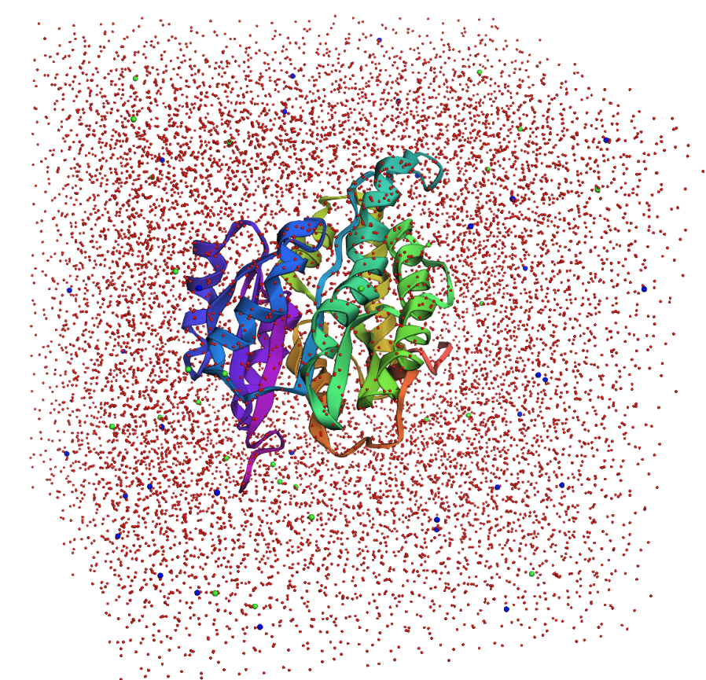

## Setting up an apo protein

An apo protein does not have any co-factors or bound molecules.  It represents the simplest case for setup and processing.  This page will document the steps for setting up a protein structure.  It will also show you how to strip out any co-factors, inhibitors, or other small molecules to a separate structure file for later processing. 

This page assumes you have already followed the steps [here](Setting_up_your_environment.md) to install the required python packages.  Activate your md environment now on the command line.

```
conda activate md
```

Navigate to the directory where you wish to work and create a subdirectory named "pdbs".

Download and place these python notebook files in your working directory: 

[protein_cleanup.ipynb](protein_cleanup.ipynb)

[protein_solvation.ipynb](protein_solvation.ipynb)

[protein_minimization.ipynb](protein_minimization.ipynb)

Open your terminal in this folder and start jupyter lab.

```
jupyter lab protein_cleanup.ipynb
```

To execute a code block in jupyter lab, you hit SHIFT+ENTER.

If you suspect your code blocks have been executed out of order, a good catch-all reset is put your cursor in the block you want to run and then go to the top menu: Kernel -> Restart Kernel and Run up to Selected Cell...

### Inspecting the pdb
One of the first code block prints out some information from the pdb.  Notice there's a description of the system in the header.

`TITLE     STRUCTURE OF INHA FROM MYCOBACTERIUM TUBERCULOSIS COMPLEXED TO NADH`

And a list of any non-protein molecules.

`HETNAM     NAD NICOTINAMIDE-ADENINE-DINUCLEOTIDE`

`HETNAM     MPD (4S)-2-METHYL-2,4-PENTANEDIOL`

`HETNAM     DMS DIMETHYL SULFOXIDE`

Read the paper details on your structure to decide what ligands to keep or discard.  In the case of this protein, only the NAD+ molecule is biologically relevant.

The protein and ligand need to be dealt with separately, so we'll first split the file into the protein + any ligands we want to keep.  The python package mdtraj is very useful for pdb manipulation with a rich selection syntax while generating very concise and readable code.  After executing this block, confirm your protein and ligand pdbs have been saved appropriately.

## Using PDBFixer to fix most protein issues

Downloaded X-ray structures are very rarely complete.  They often have missing residues, missing heavy atoms, and almost always they are missing hydrogens.  However for a simulation, we generally want a continuous protein chain with no heavy atoms missing.

PDBFixer can solve most of these issues, including patching missing residues, however this should be used with care.  Gaps of just a few residues can generally be restored and with minimization, heating, and dynamics, will be able to find a reasonable conformation in short order.  Large gaps, especially interchain gaps, of 5+ residues, may be placed by PBDFixer in particularly bad orientations and require careful restrained minimization and dynamics to equilibrate.  This particular protein structure is mostly complete with just one missing terminal residue, so there should be no issues with restoring the residue, adjust the N-terminus and C-terminus backbone atoms, and adding Hydrogens.

If your protein has many titratable groups (HIS, ASP, GLU, LYS, etc..) that can be in multiple protonation states, especially if these groups are involved in binding or catalysis, you should consider the protonation carefully.  Histidine in particular can easily exist in its neutral state (HIE or HID) or its positively charged state (HIP).  Inspection of the structure and the local environment of each histidine may be needed to assign these well. 

As a final check, load the original pdb and the fixed protein pdb file in pymol and confirm the restored Methionine residue.

## Ligand considerations

There are multiple ways to deal with ligands or co-factors in an x-ray structure.  If it is a relatively small organic molecule, there are paramterization tools available in OpenMM and AMBER.  OpenMM can parameterize a small ligand using the GAFF2 forcefield (part of the ambertools package) or their own implementation called SMIRNOFF.  If the ligand is very common (ATP/ADP, NAD+/NADH, HEME groups, etc..), there may already be published forcefield parameters that have been refined beyond the capability of the automated workflows of GAFF2 and SMIRNOFF.  For example, see [Amber parameter database](http://amber.manchester.ac.uk/). For a large important co-factor like NAD+, you should be skeptical of just using the automated GAFF2 or SMIRNOFF, and search for already refined parameters. That said, we can do some ligand processing to generate a canonical structure.  

There is an optional example block for splitting out ligands and saving a structure file and chemical descriptors in the cleanup script.  Its recommended to skip this step for the first pass, as it adds considerable complexity to the setup.  

## Solvating your system

To mimic the cellular environment, we usually immerse the protein in a box of water molecules. The box uses periodic boundary conditions to simulate an extended expanse of water.  When an atom passes through the box boundary on one side, an identical copy enters the box on the opposite side with the same velocity.  While only the central box is updated during a simulation, the neighbouring boxes are included in the calculation of long range forces (coulombic electrostatic forces). One requirement for using periodic boundary conditions is the solvent box must be charge neutral.  So if the protein had a +5 overall charge, an extra 5 $Cl^-$ ions would be added to ensure neutrality. 

Run the `protein_solvation.ipynb` notebook to see the results of solvating your protein, you should see something similar to this:

<figure markdown="span">
  { width="600" }
  <figcaption>Protein immersed in a water box</figcaption>
</figure>

## Setting up a simulation and minimizing

Open `protein_minimization.ipynb` in jupyter lab to run your first simulation task - minimization.  The addition of hydrogens, missing residues, waters, and ions to your system, all will raise the potential energy significantly.  A short minimization will allow all the added elements to relax and adapt a more favorable conformation.

However, because the initial energy is usually quite high, we want to put some breaks in place so our protein doesn't unfold or undergo severe conformational changes.  The usual procedure is to restrain the protein backbone, essentially holding it in place, and allow all the other aspects of the system to relax around this fixed backbone.  For large complex systems, we generally keep the restraints in place for minimization, heating, and equilibration, and then slowly release the restraints during equilibration.  

Check the initial reported potential energy and the minimized potential energy for your system.  It should have dropped considerably.


